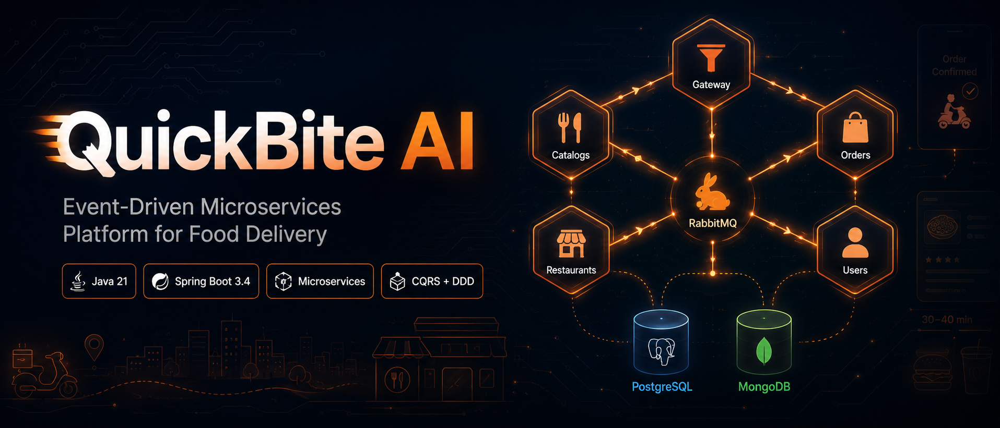
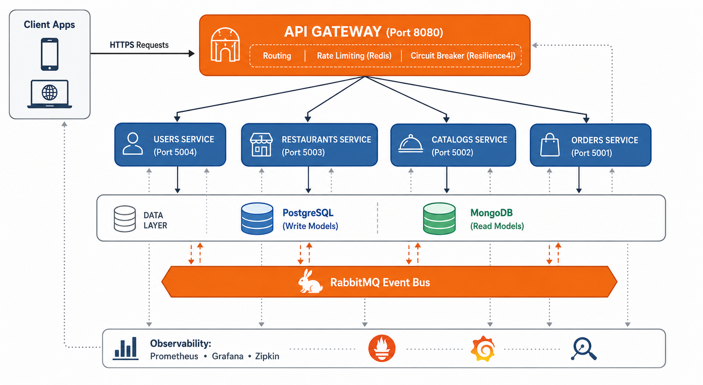
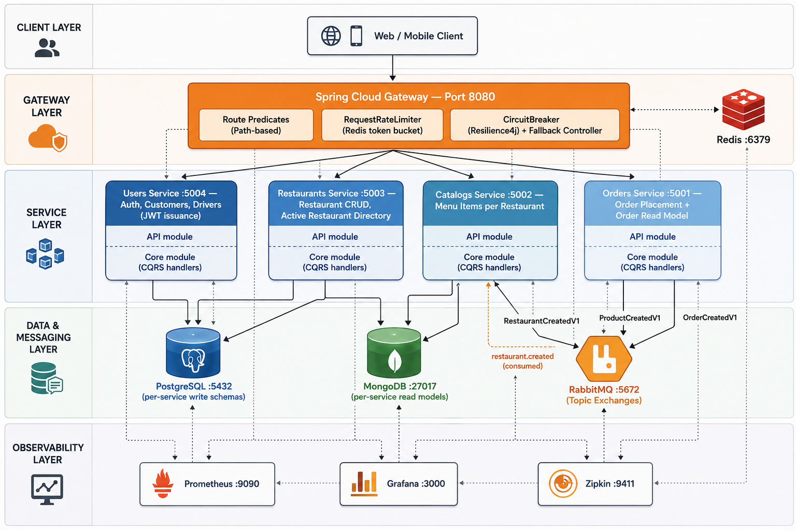
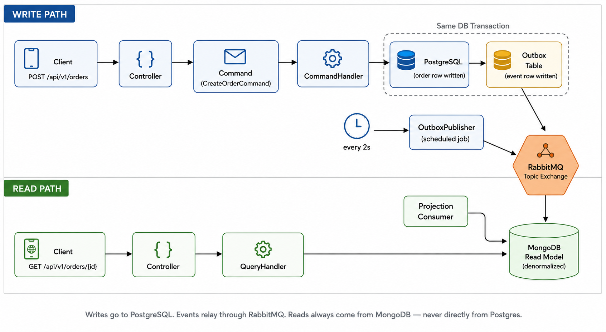
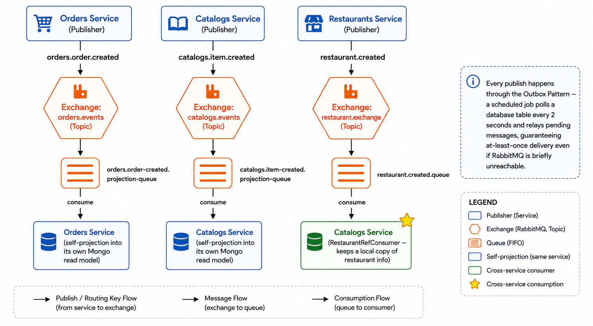
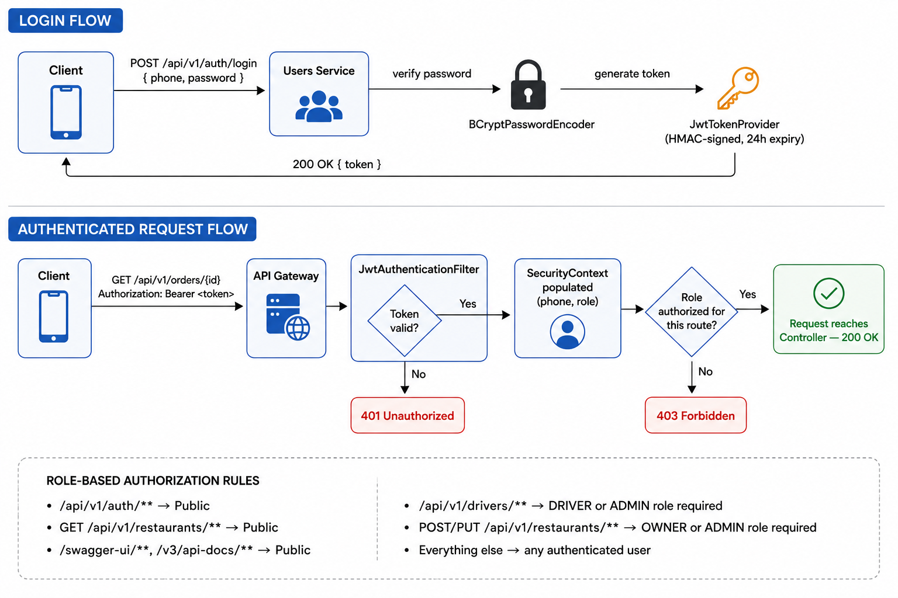
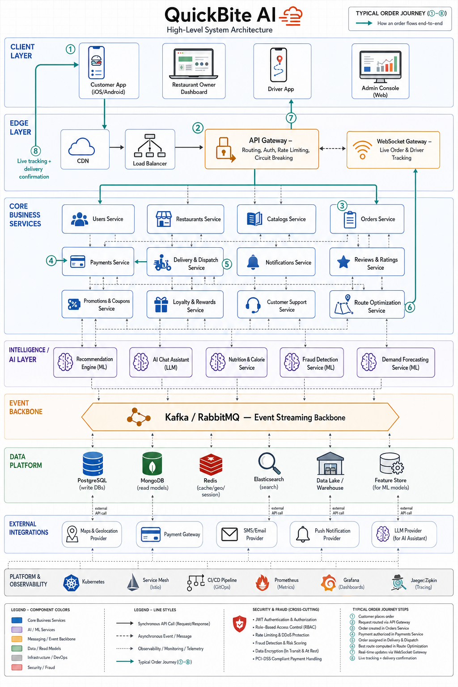
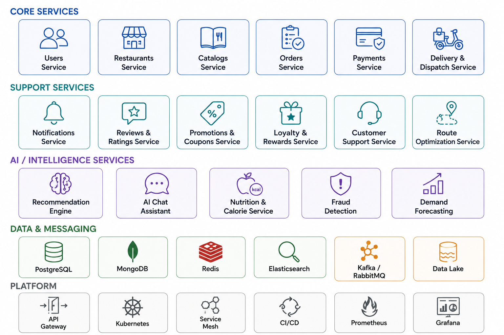
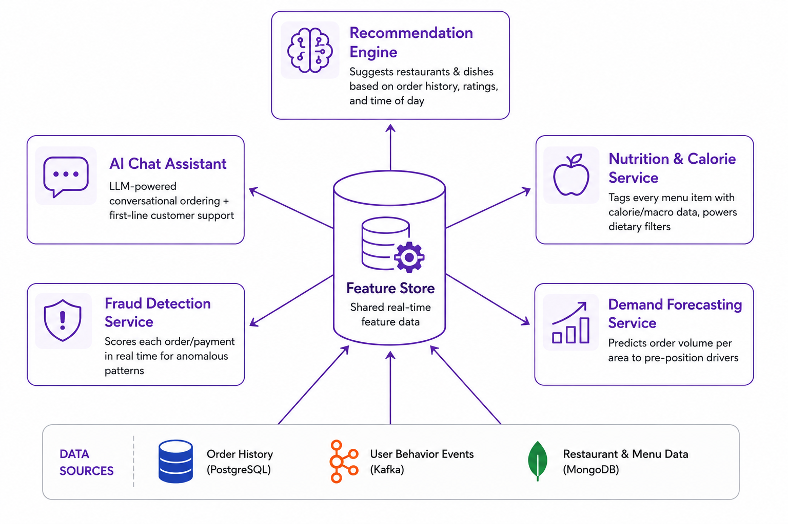
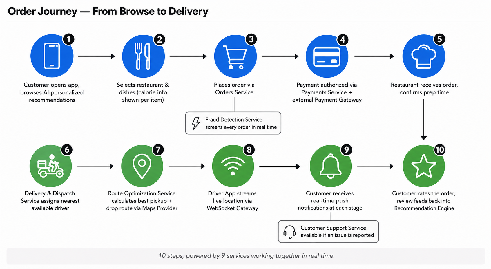

# 🍔 QuickBite AI — Food Delivery Microservices Platform

<p align="center">
  
</p>

<p align="center">
  
  
  
  
  
  
</p>

> **QuickBite AI** is a distributed, event-driven food delivery backend built entirely on **Java 21** and the **Spring** ecosystem. It's engineered the way real production food-delivery platforms (think Swiggy/Zomato/DoorDash-style systems) are designed under the hood — a fleet of **independently deployable microservices**, each owning its own data, talking to each other **asynchronously over RabbitMQ**, secured with **JWT**, exposed through a single **API Gateway**, and fully observable through **Prometheus, Grafana, and Zipkin**.

> [!NOTE]
> This is a technical showcase project. The business domain (restaurants, catalogs, orders, users/drivers) is intentionally simple — the real complexity lives in the **architecture**: Microservices + Vertical Slice Architecture + CQRS + DDD + Event-Driven Communication + Outbox Pattern + Observability stack, all wired together and runnable with Docker.

> [!WARNING]
> This project is actively evolving. New services, patterns, and infrastructure pieces are being added incrementally — see the [Roadmap](#-roadmap) section below.

---

## ⭐ Support

If this project helped you understand microservices architecture, please consider giving it a star — it really helps!

---

## 📖 Table of Contents

- [🍔 QuickBite AI — Food Delivery Microservices Platform](#-quickbite-ai--food-delivery-microservices-platform)
  - [⭐ Support](#-support)
  - [📖 Table of Contents](#-table-of-contents)
  - [🚀 What Is QuickBite AI](#-what-is-quickbite-ai)
  - [✨ Key Features](#-key-features)
  - [🏗️ High-Level Architecture](#️-high-level-architecture)
  - [🧩 Microservices Breakdown](#-microservices-breakdown)
    - [1. API Gateway](#1-api-gateway)
    - [2. Users Service](#2-users-service)
    - [3. Restaurants Service](#3-restaurants-service)
    - [4. Catalogs Service](#4-catalogs-service)
    - [5. Orders Service](#5-orders-service)
    - [6. Building Blocks (Shared Kernel)](#6-building-blocks-shared-kernel)
    - [7. Shared (Contracts / Events)](#7-shared-contracts--events)
  - [🌐 Ports \& Endpoints Reference](#-ports--endpoints-reference)
  - [🔌 API Routes — Full Reference](#-api-routes--full-reference)
  - [📡 Event-Driven Communication (RabbitMQ)](#-event-driven-communication-rabbitmq)
  - [🗄️ Data Architecture (Polyglot Persistence + CQRS)](#️-data-architecture-polyglot-persistence--cqrs)
  - [🔐 Security Architecture](#-security-architecture)
  - [📊 Observability Stack](#-observability-stack)
  - [🛠️ Tech Stack \& External Services](#️-tech-stack--external-services)
  - [📂 Project Structure](#-project-structure)
  - [🧱 Architectural Patterns Used](#-architectural-patterns-used)
  - [⚙️ How to Run](#️-how-to-run)
    - [1. Start Infrastructure](#1-start-infrastructure)
    - [2. Build the Modules](#2-build-the-modules)
    - [3. Run the Services](#3-run-the-services)
    - [4. Explore](#4-explore)
  - [🔮 Future Vision — Planned Architecture](#-future-vision--planned-architecture)
  - [🗺️ Roadmap](#️-roadmap)
  - [🤝 Contribution](#-contribution)
  - [📜 License](#-license)

---

## 🚀 What Is QuickBite AI

QuickBite AI simulates the backend of a real-world food delivery app — customers browsing restaurants, restaurant owners managing their menus, drivers accepting deliveries, and orders flowing through the system — but built with the same architectural rigor used in large-scale distributed systems:

- Every business capability lives in its **own microservice** with its **own database**.
- Services **never call each other's databases directly** — they talk through **REST (sync)** and **RabbitMQ events (async)**.
- Write operations and read operations are **split (CQRS)** — Postgres for transactional writes, MongoDB for fast, denormalized read models built via **event-driven projections**.
- Reliability is guaranteed with the **Outbox Pattern**, so an event is never lost even if RabbitMQ is briefly unavailable.
- A single **API Gateway** is the only public entry point, providing **routing, rate-limiting, and circuit breaking**.
- The whole system is **observable end-to-end** with distributed tracing, metrics, and dashboards.

<p align="center">
  
  <br/>
  <i>Client → API Gateway → four core services → data layer (PostgreSQL + MongoDB) → RabbitMQ event bus → observability stack</i>
</p>

---

## ✨ Key Features

- ✅ **Microservices Architecture** — 4 independently deployable business services (`users`, `restaurants`, `catalogs`, `orders`) + 1 API Gateway
- ✅ **Vertical Slice Architecture** — each feature (command/query) is a self-contained folder: request → handler → data access, instead of horizontal service/repository/controller layers
- ✅ **CQRS Pattern** implemented on a **hand-rolled Mediator** (`building-blocks/mediator`) — no third-party MediatR-style library, fully custom `ICommand`, `IQuery`, `ICommandHandler`, `IQueryHandler`, and Pipeline Behaviors
- ✅ **Domain-Driven Design** primitives — `AggregateRoot`, `Entity` base classes in the shared kernel
- ✅ **Event-Driven Architecture** on top of **RabbitMQ** using **Topic Exchanges** — each service publishes domain events and projects them into its own read model
- ✅ **Outbox Pattern** (`OutboxMessage`, `OutboxPublisher`, scheduled every 2s) for **guaranteed / at-least-once delivery** of events, decoupled from RabbitMQ availability
- ✅ **Polyglot Persistence** — **PostgreSQL** for write-side relational data (via Spring Data JPA), **MongoDB** for read-side projections (via Spring Data MongoDB)
- ✅ **JWT-based Authentication & Authorization** — stateless security, role-based access (`OWNER`, `DRIVER`, `ADMIN`) shared across services via the `building-blocks` module
- ✅ **API Gateway** built on **Spring Cloud Gateway** (Reactive/Netty) — request routing, per-IP **rate limiting** (Redis-backed token bucket), and **circuit breakers** (Resilience4j) with graceful fallback responses
- ✅ **Distributed Tracing** with **Micrometer Tracing + OpenTelemetry bridge**, exported to **Zipkin**
- ✅ **Metrics & Dashboards** via **Spring Boot Actuator + Micrometer Prometheus registry**, scraped by **Prometheus**, visualized in **Grafana**
- ✅ **OpenAPI / Swagger Documentation** auto-generated via **Springdoc OpenAPI**
- ✅ **Dockerized Infrastructure** — one `docker-compose` file spins up Postgres, MongoDB, RabbitMQ, Redis, Zipkin, Prometheus, and Grafana
- ✅ **Multi-Module Maven Build** — a single root POM orchestrating 7+ Maven modules with a shared dependency-management BOM

---

## 🏗️ High-Level Architecture

All external traffic flows through **one public entry point — the API Gateway**. Clients never talk to a microservice directly. The Gateway resolves the target service by path, applies rate-limiting and circuit-breaking, and reverse-proxies the request.

Internally, each microservice is **fully autonomous**:
- Owns its **own schema/database** (no shared DB across services)
- Exposes its own REST API + Swagger docs
- Publishes/consumes **domain events** over RabbitMQ instead of making synchronous calls to its siblings
- Can be built, tested, deployed, and scaled independently

<p align="center">
  
  <br/>
  <i>Full layered view — Client, Gateway, Service, Data & Messaging, and Observability layers with every port and event labeled</i>
</p>

The **CQRS** side of the architecture looks like this per service:

```
        WRITE PATH                              READ PATH
   Client → Controller → Command → Handler   Client → Controller → Query → Handler
              → PostgreSQL (JPA)                        → MongoDB (Read Model)
                    │                                          ▲
                    ▼                                          │
              Outbox Table  ──(scheduled poll)──▶ RabbitMQ ──▶ Projection Consumer
```

<p align="center">
  
  <br/>
  <i>Write path (Command → PostgreSQL + Outbox in one transaction → scheduled relay → RabbitMQ) and Read path (Query → MongoDB Read Model)</i>
</p>

---

## 🧩 Microservices Breakdown

### 1. API Gateway
The single public-facing entry point into the system.

- **Framework**: Spring Cloud Gateway (reactive, Netty-based)
- **Responsibilities**: path-based routing, per-service circuit breaking, Redis-backed rate limiting, fallback responses
- **Port**: `8080`
- **Module**: `api-gateway`

### 2. Users Service
Handles authentication, customer profiles, addresses, and driver profiles/status.

- **Sub-modules**: `users-api` (REST layer), `users-core` (domain + CQRS handlers)
- **Database**: PostgreSQL (`quickbite_users`)
- **Port**: `5004`
- **Responsibilities**: registration/login (JWT issuance), customer address book, driver onboarding, driver online/offline toggling, live driver location updates

### 3. Restaurants Service
Restaurant onboarding and directory management for both the public app and restaurant owners.

- **Sub-modules**: `restaurants-api`, `restaurants-core`
- **Databases**: PostgreSQL (write model, `quickbite_restaurants`) + MongoDB (read model)
- **Port**: `5003`
- **Events published**: `RestaurantCreatedV1` → `restaurant.exchange`
- **Responsibilities**: restaurant creation/updates by owners, public browsing of active restaurants

### 4. Catalogs Service
Menu / catalog-item management per restaurant.

- **Sub-modules**: `catalogs-api`, `catalogs-core`
- **Databases**: PostgreSQL (write model, `quickbite_catalogs`) + MongoDB (read model, via `CatalogReadModel` projection)
- **Port**: `5002`
- **Events consumed**: restaurant reference data (`RestaurantRefConsumer`) to keep a local read-only copy of restaurant info
- **Events published**: `ProductCreatedV1` → `catalogs.events` exchange
- **Responsibilities**: adding/updating menu items, serving a restaurant's full public catalog

### 5. Orders Service
Order placement and order-status read models.

- **Sub-modules**: `orders-api`, `orders-core`
- **Databases**: PostgreSQL (write model, `quickbite_orders`) + MongoDB (read model, `OrderReadModel`)
- **Port**: `5001`
- **Events published**: `OrderCreatedV1` → `orders.events` exchange
- **Responsibilities**: placing new orders, retrieving order details from the projected read model

### 6. Building Blocks (Shared Kernel)
A library module (not a running service) consumed by every microservice.

- **Mediator framework**: `Mediator`, `ICommand`, `IQuery`, `ICommandHandler`, `IQueryHandler`, `IPipelineBehavior` — a custom, lightweight CQRS dispatcher
- **Pipeline behaviors**: `LoggingBehavior`, `ValidationBehavior` (Bean Validation integration for every command/query)
- **DDD base types**: `AggregateRoot`, `Entity`
- **Outbox pattern**: `OutboxMessage`, `OutboxMessageRepository`, `OutboxPublisher` (scheduled RabbitMQ relay), `OutboxStatus`
- **Security**: `JwtTokenProvider`, `JwtAuthenticationFilter`, `SecurityConfig` (shared stateless JWT security filter chain + role-based authorization rules)
- **Exceptions**: `ValidationException`

### 7. Shared (Contracts / Events)
A tiny module holding the **cross-service event contracts** (the "wire format" of the event bus):

- `OrderCreatedV1`
- `RestaurantCreatedV1`
- `ProductCreatedV1`

Versioned event names (`V1` suffix) allow the schema to evolve without breaking existing consumers.

---

## 🌐 Ports & Endpoints Reference

| Component               | Type              | Port    | Notes                                             |
|-------------------------|-------------------|---------|----------------------------------------------------|
| **API Gateway**         | Spring Cloud Gateway | `8080`  | Public entry point for all client traffic         |
| **Orders Service**      | Spring Boot (REST) | `5001`  | `/api/v1/orders/**`                                |
| **Catalogs Service**    | Spring Boot (REST) | `5002`  | `/api/v1/restaurants/**/catalog`, `/api/v1/owner/**` |
| **Restaurants Service** | Spring Boot (REST) | `5003`  | `/api/v1/restaurants/**`                           |
| **Users Service**       | Spring Boot (REST) | `5004`  | `/api/v1/auth`, `/users`, `/customers`, `/drivers` |
| **PostgreSQL**          | Relational DB      | `5432`  | Write-side database (per-service logical DBs)     |
| **MongoDB**             | Document DB        | `27017` | Read-side projections (CQRS read models)          |
| **RabbitMQ (AMQP)**     | Message Broker     | `5672`  | Event bus (topic exchanges)                       |
| **RabbitMQ Management** | Web UI             | `15672` | Broker dashboard (guest/guest)                    |
| **Redis**               | In-memory store    | `6379`  | Gateway rate-limiter token bucket store            |
| **Zipkin**              | Tracing UI/Collector | `9411`  | Distributed trace visualization                  |
| **Prometheus**          | Metrics TSDB       | `9090`  | Scrapes `/actuator/prometheus` from every service |
| **Grafana**             | Dashboards         | `3000`  | Default login `admin` / `admin`                   |

> [!IMPORTANT]
> Currently the API Gateway routes **`catalogs-service`**, **`orders-service`**, and **`restaurants-service`**. The **`users-service`** is not yet wired into the Gateway's route table — see [Roadmap](#-roadmap).

---

## 🔌 API Routes — Full Reference

**Users Service** (`/api/v1`, port `5004`)
| Method | Route | Auth | Description |
|---|---|---|---|
| POST | `/auth/register` | Public | Register a new user |
| POST | `/auth/login` | Public | Authenticate and receive JWT |
| GET | `/users/me` | JWT | Current authenticated user's profile |
| GET | `/users/{id}` | JWT | Fetch a user by ID |
| POST | `/customers/addresses` | JWT | Add a delivery address |
| GET | `/customers/addresses` | JWT | List saved addresses |
| POST | `/drivers/profile` | JWT (DRIVER/ADMIN) | Register a driver profile |
| PATCH | `/drivers/status` | JWT (DRIVER/ADMIN) | Toggle driver online/offline |
| PUT | `/drivers/location` | JWT (DRIVER/ADMIN) | Update live driver location |

**Restaurants Service** (`/api/v1/restaurants`, port `5003`)
| Method | Route | Auth | Description |
|---|---|---|---|
| GET | `/restaurants` | Public | List all active restaurants |
| GET | `/restaurants/{id}` | Public | Get a restaurant by ID |
| POST | `/restaurants` | JWT (OWNER/ADMIN) | Create a restaurant |
| PUT | `/restaurants/{id}` | JWT (OWNER/ADMIN) | Update a restaurant |

**Catalogs Service** (port `5002`)
| Method | Route | Auth | Description |
|---|---|---|---|
| GET | `/api/v1/restaurants/{restaurantId}/catalog` | Public | Get a restaurant's full menu |
| POST | `/api/v1/owner/restaurants/{restaurantId}/catalog/items` | JWT | Add a menu item |
| PUT | `/api/v1/owner/restaurants/{restaurantId}/catalog/items/{itemId}` | JWT | Update a menu item |

**Orders Service** (`/api/v1/orders`, port `5001`)
| Method | Route | Auth | Description |
|---|---|---|---|
| POST | `/orders` | JWT | Place a new order |
| GET | `/orders/{id}` | JWT | Get order details (read model) |

**Gateway-level fallbacks** (returned when a downstream circuit breaker is open)
| Route | Description |
|---|---|
| `GET /fallback/catalogs` | 503 fallback for Catalogs Service |
| `GET /fallback/orders` | 503 fallback for Orders Service |
| `GET /fallback/restaurants` | 503 fallback for Restaurants Service |

---

## 📡 Event-Driven Communication (RabbitMQ)

Every service publishes its domain events to its own **Topic Exchange**, and interested services bind their own **queues** to consume relevant events — services never query another service's database directly.

| Exchange | Routing Key | Queue | Published By | Consumed By | Event |
|---|---|---|---|---|---|
| `orders.events` | `orders.order.created` | `orders.order-created.projection-queue` | Orders Service | Orders Service (self-projection) | `OrderCreatedV1` |
| `catalogs.events` | `catalogs.item.created` | `catalogs.item-created.projection-queue` | Catalogs Service | Catalogs Service (self-projection) | `ProductCreatedV1` |
| `restaurant.exchange` | `restaurant.created` | `restaurant.created.queue` | Restaurants Service | Catalogs Service (`RestaurantRefConsumer`) | `RestaurantCreatedV1` |

Every publish happens through the **Outbox Pattern**:
1. A command handler writes the business row **and** an `OutboxMessage` row in the **same DB transaction**.
2. A `@Scheduled` `OutboxPublisher` polls for `PENDING` outbox rows every **2 seconds**.
3. It relays the payload to the correct RabbitMQ exchange/routing key and marks it `PROCESSED` (or `FAILED` with the error captured for retry/inspection).

This guarantees **at-least-once delivery** even if RabbitMQ is temporarily down when the transaction commits.

<p align="center">
  
  <br/>
  <i>Every exchange, routing key, and queue in the system — including the one cross-service consumption (Catalogs consuming RestaurantCreatedV1)</i>
</p>

---

## 🗄️ Data Architecture (Polyglot Persistence + CQRS)

| Service | Write DB (PostgreSQL) | Read DB (MongoDB) | ORM / Data Access |
|---|---|---|---|
| Users | `quickbite_users` | — | Spring Data JPA |
| Restaurants | `quickbite_restaurants` | `quickbite_restaurants` (read model) | Spring Data JPA + Spring Data MongoDB |
| Catalogs | `quickbite_catalogs` | `quickbite_catalogs` (read model) | Spring Data JPA + Spring Data MongoDB |
| Orders | `quickbite_orders` | `quickbite_orders` (read model) | Spring Data JPA + Spring Data MongoDB |

- **Write side**: normalized relational schema in Postgres, changes flow through Mediator command handlers.
- **Read side**: denormalized MongoDB documents built asynchronously by **Projection Consumers** listening on RabbitMQ — optimized purely for fast reads, decoupled from the write schema.
- Each database is **logically isolated per service** even though, in local development, they share one Postgres/MongoDB container for convenience.

---

## 🔐 Security Architecture

- **Stateless JWT authentication** — no server-side sessions (`SessionCreationPolicy.STATELESS`)
- **`JwtAuthenticationFilter`** validates the bearer token on every request before it reaches a controller
- **`JwtTokenProvider`** issues and parses tokens (HMAC-signed, 24h expiry)
- **`BCryptPasswordEncoder`** for password hashing
- **Role-based route authorization**, defined centrally in `SecurityConfig` (shared kernel):
  - `/api/v1/auth/**` → public
  - `GET /api/v1/restaurants/**` → public (browsing)
  - `/swagger-ui/**`, `/v3/api-docs/**` → public (API docs)
  - `/api/v1/drivers/**` → `DRIVER` or `ADMIN`
  - `POST/PUT /api/v1/restaurants/**` → `OWNER` or `ADMIN`
  - everything else → any authenticated user
- **CSRF disabled** (pure stateless REST API, no cookies/browser forms)

<p align="center">
  
  <br/>
  <i>Login flow (credential check → token issuance) and authenticated request flow (token validation → role check → controller)</i>
</p>

---

## 📊 Observability Stack

QuickBite AI ships with a full three-pillar observability setup out of the box:

| Pillar | Tool | How |
|---|---|---|
| **Metrics** | Prometheus + Grafana | Every service exposes `/actuator/prometheus` via Micrometer's Prometheus registry; `prometheus.yml` scrapes the Gateway (`8080`), Orders (`5001`), Catalogs (`5002`), and Restaurants (`5003`) every 5s |
| **Tracing** | Zipkin + Micrometer Tracing (OpenTelemetry bridge) | 100% trace sampling in local dev; trace/span IDs injected directly into console log patterns |
| **Logging** | SLF4J / Logback console appender | Structured console logs with `[traceId, spanId]` correlation for every request |
| **Health** | Spring Boot Actuator | `health`, `info`, `metrics`, `prometheus`, and (on the Gateway) `gateway` endpoints exposed |

---

## 🛠️ Tech Stack & External Services

**Core Framework & Language**
- ✔️ **Java 21**
- ✔️ **Spring Boot 3.4.2**
- ✔️ **Spring Cloud 2024.0.0**

**Microservices & Gateway**
- ✔️ **Spring Cloud Gateway** — reactive routing, filters, predicates
- ✔️ **Resilience4j** — reactive circuit breaker for the Gateway
- ✔️ **Spring Data Redis (Reactive)** — backs the Gateway's rate limiter

**Persistence**
- ✔️ **Spring Data JPA** + **PostgreSQL 17 (Alpine)** — write-side relational storage
- ✔️ **Spring Data MongoDB** + **MongoDB 7.0** — read-side projections
- ✔️ **HikariCP** — JDBC connection pooling

**Messaging**
- ✔️ **RabbitMQ 3.13 (management-alpine)** — event bus, topic exchanges, durable queues
- ✔️ **Spring AMQP** — declarative exchange/queue/binding configuration, `Jackson2JsonMessageConverter` for JSON payloads

**Security**
- ✔️ **Spring Security** — filter chain, method/role authorization
- ✔️ **JJWT (io.jsonwebtoken) 0.12.5** — JWT creation/parsing (`jjwt-api`, `jjwt-impl`, `jjwt-jackson`)
- ✔️ **BCrypt** — password hashing

**Observability**
- ✔️ **Spring Boot Actuator** — health/metrics endpoints
- ✔️ **Micrometer + Micrometer Tracing (OTel bridge)** — metrics & tracing abstraction
- ✔️ **OpenTelemetry Zipkin Exporter** — ships traces to Zipkin
- ✔️ **Prometheus** — metrics scraping & time-series storage
- ✔️ **Grafana** — dashboards on top of Prometheus
- ✔️ **Zipkin** — trace collection & visualization UI

**API Documentation**
- ✔️ **Springdoc OpenAPI (2.8.3 / 2.7.0)** — auto-generated Swagger UI & OpenAPI 3 spec per service

**Utilities & Tooling**
- ✔️ **ULID Creator** — sortable unique IDs
- ✔️ **Jackson** (`jackson-databind`, `jackson-datatype-jsr310`, `jackson-annotations`) — JSON (de)serialization, Java 8 time support
- ✔️ **Lombok** — boilerplate reduction
- ✔️ **Jakarta Bean Validation** (`spring-boot-starter-validation`) — request validation wired into the Mediator's `ValidationBehavior`
- ✔️ **Maven (multi-module)** — build & dependency management across 7+ modules

**Containerization**
- ✔️ **Docker & Docker Compose** — one-command infrastructure bring-up for every dependency

---

## 📂 Project Structure

```
QuickBite-AI/
├── api-gateway/                         # Spring Cloud Gateway — public entry point
│   └── src/main/java/.../gateway/
│       ├── ApiGatewayApplication.java
│       ├── config/RateLimiterConfig.java
│       └── controller/FallbackController.java
│
├── building-blocks/                     # Shared kernel (library, not a service)
│   └── src/main/java/.../buildingblocks/
│       ├── domain/                      # AggregateRoot, Entity
│       ├── mediator/                    # Custom CQRS Mediator + Pipeline Behaviors
│       ├── outbox/                      # Outbox Pattern implementation
│       ├── security/                    # JWT filter, token provider, SecurityConfig
│       └── exceptions/
│
├── services/
│   ├── shared/                          # Cross-service event contracts (V1 events)
│   │
│   ├── users/
│   │   ├── api/                         # REST controllers, exception handling
│   │   └── core/                        # Vertical-slice features (register, login, addresses, drivers)
│   │
│   ├── restaurants/
│   │   ├── api/
│   │   └── core/                        # Features + RabbitMQ config + Read Model projections
│   │
│   ├── catalogs/
│   │   ├── api/
│   │   └── core/                        # Features + RabbitMQ config + Read Model projections
│   │
│   └── orders/
│       ├── api/
│       └── core/                        # Features + Read Model projections
│
├── docker-compose.infrastructure.yaml    # Postgres, MongoDB, RabbitMQ, Redis, Zipkin, Prometheus, Grafana
├── prometheus.yml                        # Scrape configuration for all services
└── pom.xml                               # Root multi-module Maven POM
```

Each `core` module follows **Vertical Slice Architecture** — every feature lives in its own folder with everything it needs:

```
features/
└── creatingorder/
    ├── CreateOrderCommand.java
    ├── CreateOrderCommandHandler.java
    └── CreateOrderResult.java
```

No horizontal `service/`, `repository/`, `dto/` layers shared across unrelated features — each slice is self-contained, reducing coupling and making each feature independently understandable and testable.

---

## 🧱 Architectural Patterns Used

| Pattern | Where It's Used |
|---|---|
| **Microservices Architecture** | Overall system decomposition (`users`, `restaurants`, `catalogs`, `orders`, `api-gateway`) |
| **Vertical Slice Architecture** | Every `core` module (`features/<usecase>/...`) |
| **CQRS** | Custom `Mediator` + separate `ICommand`/`IQuery` handlers, Postgres writes / MongoDB reads |
| **Domain-Driven Design** | `AggregateRoot`, `Entity` base classes; rich domain models (`Order`, `Restaurant`, `CatalogItem`) |
| **Event-Driven Architecture** | RabbitMQ topic exchanges + versioned domain events (`OrderCreatedV1`, etc.) |
| **Outbox Pattern** | `OutboxMessage` + scheduled `OutboxPublisher` for guaranteed event delivery |
| **API Gateway Pattern** | Spring Cloud Gateway routing all client traffic |
| **Circuit Breaker Pattern** | Resilience4j circuit breakers per downstream route, with dedicated fallback controllers |
| **Rate Limiting** | Redis-backed token bucket per client IP at the Gateway |
| **Pipeline / Behavior Pattern** | `LoggingBehavior`, `ValidationBehavior` wrapping every Mediator request |
| **Shared Kernel** | `building-blocks` module reused by every service |

---

## ⚙️ How to Run

### 1. Start Infrastructure

Spin up Postgres, MongoDB, RabbitMQ, Redis, Zipkin, Prometheus, and Grafana with a single command:

```bash
docker-compose -f docker-compose.infrastructure.yaml up -d
```

### 2. Build the Modules

From the project root (multi-module Maven build):

```bash
./mvnw clean install
```

This builds, in order: `building-blocks` → `services/shared` → `services/orders` → `services/catalogs` → `api-gateway` → `services/restaurants` → `services/users`.

### 3. Run the Services

Run each Spring Boot application (in separate terminals):

```bash
./mvnw spring-boot:run -pl services/users/api
./mvnw spring-boot:run -pl services/restaurants/api
./mvnw spring-boot:run -pl services/catalogs/api
./mvnw spring-boot:run -pl services/orders/api
./mvnw spring-boot:run -pl api-gateway
```

### 4. Explore

| What | Where |
|---|---|
| API Gateway | `http://localhost:8080` |
| Swagger UI (per service) | `http://localhost:<port>/swagger-ui.html` |
| RabbitMQ Management | `http://localhost:15672` (guest / guest) |
| Zipkin Traces | `http://localhost:9411` |
| Prometheus | `http://localhost:9090` |
| Grafana | `http://localhost:3000` (admin / admin) |

---

## 🔮 Future Vision — Planned Architecture

The current system (4 services + Gateway) is the **foundation**. The diagrams below map out where QuickBite AI is headed once every planned service, ML feature, and platform capability is in place — a full-scale, production-grade food delivery platform.

### Complete Future-State System Architecture

<p align="center">
  
  <br/>
  <i>The full envisioned platform — Client Layer → Edge Layer → Core Business Services → Intelligence/AI Layer → Event Backbone → Data Platform → External Integrations → Platform/Observability, with a numbered end-to-end order journey overlaid</i>
</p>

### Planned Service Catalog

Every service — existing and planned — organized by category:

<p align="center">
  
  <br/>
  <i>Core Services • Support Services • AI/Intelligence Services • Data & Messaging • Platform — the full component inventory of the target architecture</i>
</p>

### The AI / Intelligence Layer

The planned ML and LLM-powered layer, all sharing a common real-time Feature Store:

<p align="center">
  
  <br/>
  <i>Recommendation Engine, AI Chat Assistant, Nutrition & Calorie Service, Fraud Detection, and Demand Forecasting — all fed by a shared Feature Store built from order history, user behavior events, and restaurant/menu data</i>
</p>

### The Complete Order Journey (Future State)

What placing an order will look like end-to-end once the full platform is built:

<p align="center">
  
  <br/>
  <i>From AI-personalized browsing through payment, dispatch, route optimization, live tracking, and post-delivery feedback — with fraud screening and support running in parallel</i>
</p>

> [!NOTE]
> These future-state diagrams describe the **target architecture**, not the current implementation. See the [Roadmap](#-roadmap) below for what's actually built today versus what's planned.

---

## 🗺️ Roadmap

| Feature | Status |
|---|---|
| Building Blocks (Mediator, Outbox, Security) | ✅ Completed |
| API Gateway (routing, rate-limiting, circuit breaking) | ✅ Completed |
| Restaurants Service | ✅ Completed |
| Catalogs Service | ✅ Completed |
| Orders Service | ✅ Completed |
| Users Service (auth, customers, drivers) | ✅ Completed |
| Wire Users Service into API Gateway routes | ✅ Completed |
| Enhancing Schema and wiring up | ✅ Completed |
| Delivery & Dispatch Service | ✅ Completed |
| Payments Service | ❌ Not Started |
| Route Optimization Service (Maps/ETA) | ❌ Not Started |
| Live Tracking Service (WebSocket) | ❌ Not Started |
| Notifications Service (push/SMS/email) | ❌ Not Started |
| Reviews & Ratings Service | ❌ Not Started |
| Promotions & Coupons Service | ❌ Not Started |
| Loyalty & Rewards Service | ❌ Not Started |
| Customer Support Service | ❌ Not Started |
| Recommendation Engine (ML) | ❌ Not Started |
| AI Chat Assistant (LLM) | ❌ Not Started |
| Nutrition & Calorie Service | ❌ Not Started |
| Fraud Detection Service (ML) | ❌ Not Started |
| Demand Forecasting Service (ML) | ❌ Not Started |
| Kubernetes / Helm deployment manifests | ❌ Not Started |
| CI/CD pipeline (GitHub Actions) | ❌ Not Started |
| Centralized log aggregation (ELK/Loki) | ❌ Not Started |

---

## 🤝 Contribution

This project is under active development. Feel free to open an issue or submit a pull request with improvements, fixes, or new microservices.

---

## 📜 License

This project currently has no explicit license file in the repository. Please check with the repository owner ([Anuj-k-45](https://github.com/Anuj-k-45)) before reuse in other projects.

<p align="center">
  Built with ☕ Java, 🌱 Spring, and a genuine love for distributed systems.
  <br/>
  <a href="https://github.com/Anuj-k-45/QuickBite-AI">github.com/Anuj-k-45/QuickBite-AI</a>
</p>